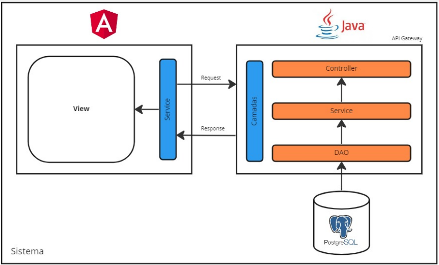

<h2> Projeto Barber Helper </h2>
<h3> 1 - Visão Geral do Software </h3>

Toda barbearia se inicia sem um gerenciamento dos agendamentos dos serviços, muitos seguem realizando esse serviço por meio de anotações em cadernos, porém é algo que toma o tempo de serviço para deixar bem organizado. Com o uso do Barber Helper tudo fica automatizado deixando de lado a necessidade de anotações e outros controles, podendo ter até ter a possibilidade de gerenciar o caixa e de vender produtos na plataforma.

<h4> 1.1 - Objetivo do Software </h4>

   O objetivo do Barber Helper é automatizar todo o agendamento de serviços de uma barbearia, aumentando a produtividade lucratividade do estabelecimento, tendo a possibilidade de ter um gerenciamento de gastos, serviços mais atendidos, promoções, produtos e avaliações de profissionais.

    
    

    
    

<h4> 1.2 - Escopo do Projeto e Requisitos de Software </h4>

Os requisitos funcionais descrevem as funções, que o sistema deve executar e as tarefas que ele deve realizar. Neste documento, apresentaremos os requisitos funcionais do Projeto Barber Helper, definidos a partir das necessidades do cliente vinculado a este projeto. Além das principais necessidades e requisitos funcionais, apresentaremos uma descrição detalhada de como o modelo Entidade-Relacionamento (ER) foi desenvolvido para atender a esses requisitos, incluindo as entidades, relacionamentos e atributos necessários para armazenar e gerenciar as informações do sistema.

 

Após diversas reuniões com o cliente, restringiu-se o escopo deste projeto a implementação de um aplicação web que contemple as necessidades detalhadas abaixo:

 
<ul>
<li> Autenticação e controle de acesso;
</li>
<li>
Cadastro Funcionário e Cliente;
</li>
<li>
Agendamento de horários;
</li>
<li>
Cadastramento dos serviços de barbearia;
</li>
<li>
Controle financeiro: despesas e receitas;
</li>
<li>
Relatórios de serviços;
</li>
<li>
Possibilidade de implementação;
</li>
<li>
Loja virtual de cosméticos;
</li>
<li>
Pagamento;
</li>

</ul>
 
 

 Fundamentado nas necessidades levantadas com o cliente, foram identificados os seguintes requisitos funcionais :
 
 

<table>
    <thead>
    <tr>
        <th>ID</>
        <th> Nome </th>
        <th>DESCRIÇÃO</>
    </tr>
    </thead>
    <tbody>
        <tr>
            <td><b>RF01</b></td>
            <td><b>Manter pessoas</b></td>
            <td>O sistema deve permitir incluir, excluir, atualizar e buscar informações de pessoas, como nome, cpf, celular e e-mail. A busca será realizada pelo e-mail e os dados persistidos em um banco de dados</td>
        </tr>
        <tr>
            <td><b>RF02</b></td>
            <td><b>Manter promoções</b></td>
            <td>o sistema deve permitir incluir, excluir, atualizar e buscar informações de promoções</td>
        </tr>
        <tr>
            <td><b>RF03</b></td>
            <td><b>Manter produtos</b></td>
            <td>o sistema deve permitir incluir, excluir, atualizar e buscar informações de produtos</td>
        </tr>
        <tr>
            <td><b>RF04</b></td>
            <td><b>Manter serviços</b></td>
            <td>o sistema deve permitir incluir, excluir, atualizar e buscar informações de serviços</td>
        </tr>
        <tr>
            <td><b>RF05</b></td>
            <td><b>Controle de acesso</b></td>
            <td>Manter todos os perfils de acesso e controles para não permitir acesso por pessoas não permitidas</td>
        </tr>
        <tr>
            <td><b>RF06</b></td>
            <td><b>Controle financeiro</b></td>
            <td>Armazenar e mostrar com gráficos todo o controle de caixa, entrada e saida de todos os serviços e produtos</td>
        </tr>
        <tr>
            <td><b>RF07</b></td>
            <td><b>Agendar horario</b></td>
            <td>Realizar agendamento selecionando serviços, profissionais, data e horario</td>
        </tr>
    </tbody>
</table>

 
<h4> 1.4 - Modelo de Domínio </h2>

A documentação do modelo Entidade-Relacionamento (ER) é uma etapa crucial no processo de desenvolvimento de um sistema de informação. O modelo ER é usado para representar a estrutura do banco de dados, incluindo as entidades, relacionamentos e atributos. A partir desse modelo, é possível criar um esquema de banco de dados que possa ser implementado em um sistema de gerenciamento de banco de dados (SGBD). Neste documento, apresentaremos o modelo ER para Sistema de Controle de Acesso a Ambientes que contém a descrição detalhada dessa estrutura, incluindo as entidades, relacionamentos, chaves primárias e estrangeiras.

    
    

 
<h3> 2 - Arquitetura do Software </h3>

 A arquitetura de software de uma aplicação é o conjunto de decisões de design que definem como os diferentes componentes do sistema se relacionam e interagem entre si. Ela é responsável por garantir que a aplicação seja escalável, segura e capaz de lidar com as demandas dos usuários de forma eficiente. A documentação técnica da arquitetura de software é uma parte fundamental do processo de desenvolvimento, pois ajuda a equipe a entender como o sistema funciona e como cada componente se relaciona com os demais. Neste documento, serão descritos os principais componentes da arquitetura da aplicação, como eles se comunicam e quais são as suas responsabilidades. Além disso, serão apresentadas as principais tecnologias utilizadas na implementação da arquitetura, assim como as decisões de design que levaram à escolha dessas tecnologias.

    

<h4> 2.1 - Tecnologias da implementação </h2>
 

A definição das tecnologias ao implementar um aplicativo web é crucial para garantir eficiência, escalabilidade, segurança e uma boa experiência do usuário. A escolha adequada das tecnologias alinhadas aos requisitos do projeto, integração com outros sistemas, segurança avançada e interfaces responsivas é fundamental para o sucesso do desenvolvimento. Além disso, a seleção de tecnologias populares e bem suportadas agiliza o processo, permite maior interoperabilidade e facilita a resolução de problemas. Dentro deste contexto, definiu-se o uso das tecnologias abaxio para que se alcance com êxito a escalabilidade, eficiência, segurança e usabilidade do aplicativo web em desenvolvimento.

 
<ul>
<li><b>Docker: </b>Docker é uma plataforma de virtualização de contêineres que permite empacotar e distribuir aplicativos em ambientes isolados. Ele fornece uma maneira fácil e eficiente de criar, implantar e executar aplicativos em diferentes sistemas operacionais, garantindo consistência e portabilidade.</li>
<li><b>Angular:</b> Angular é um framework de desenvolvimento web front-end mantido pelo Google. Ele permite a criação de aplicações web dinâmicas e responsivas por meio do uso de componentes reutilizáveis. Com recursos como data binding, injeção de dependência e roteamento, o Angular simplifica o desenvolvimento de interfaces de usuário complexas.
</li>
<li><b>Spring Boot:</b> Spring Boot é um framework de desenvolvimento de aplicativos Java que simplifica a criação de aplicativos autônomos e prontos para produção. Ele fornece uma configuração rápida e automática de componentes comuns do ecossistema Spring, permitindo que os desenvolvedores se concentrem na lógica de negócios em vez de configurar e integrar diferentes camadas do aplicativo.</li>
<li><b>PostgreSQL:</b> PostgreSQL é um sistema de gerenciamento de banco de dados relacional de código aberto e altamente escalável. Ele oferece suporte a recursos avançados, como consultas complexas, transações ACID, replicação e extensibilidade. O PostgreSQL é amplamente utilizado em aplicações que exigem um banco de dados confiável e poderoso, fornecendo uma sólida base para armazenamento e manipulação de dados.</li>
</ul>
 
<h3> 3 - Divisão de tarefas </h3>

 A baixo está descrito nossa divisão de tarefas e prazos feitos por cada integrante do grupo:

 
 

<table>
    <thead>
    <tr>
        <th>DEMANDA</>
        <th>RESPONSÁVEL</th>
        <th>PRAZO</>
        <th>SITUAÇÃO</>
    </tr>
    </thead>
    <tbody>
        <tr>
            <td><b>Definição do Escopo do Projeto</b></td>
            <td><b>Eduardo</b></td>
            <td>01/09/2023</td>
            <td>FINALIZADO</td>
        </tr>
        <tr>
            <td><b>Inicializar Projeto</b></td>
            <td><b>Eduardo</b></td>
            <td>08/09/2023</td>
            <td>FINALIZADO</td>
        </tr>
        <tr>
            <td><b>Configuração do Ambiente de Desenvolvimento</b></td>
            <td><b>João Paulo</b></td>
            <td>10/09/2023</td>
            <td>FINALIZADO</td>
        </tr>
        <tr>
            <td><b>Ajustes da API Java (Spring Boot)</b></td>
            <td><b>Magno</b></td>
            <td>25/09/2023</td>
            <td>FINALIZADO</td>
        </tr>
        <tr>
            <td><b>Desenvolvimento das Telas Iniciais no Ionic</b></td>
            <td><b>Diogo</b></td>
            <td>15/10/2023</td>
            <td>FINALIZADO</td>
        </tr>
        <tr>
            <td><b>Integração API - Frontend</b></td>
            <td><b>João Paulo e Magno</b></td>
            <td>30/10/2023</td>
            <td>FINALIZADO</td>
        </tr>
        <tr>
            <td><b>Desenvolvimento do Design de Tela</b></td>
            <td><b>Diogo</b></td>
            <td>20/11/2023</td>
            <td>FINALIZADO</td>
        </tr>
        <tr>
            <td><b>Testes e Correções de detalhes</b></td>
            <td><b>Todos</b></td>
            <td>01/12/2023</td>
            <td>FINALIZADO</td>
        </tr>
        <tr>
            <td><b>Videos e prepação de pitch</b></td>
            <td><b>Todos</b></td>
            <td>06/12/2023</td>
            <td>FINALIZADO</td>
        </tr>
    </tbody>
</table>

 
 
<h3> Referências </h3>
 
<ol>
<li>Docker. Disponível em: https://www.docker.com/. Acesso em: 05 maio 2023.</li>
<li>Angular. Disponível em: https://angular.io/. Acesso em: 05 maio 2023.</li>
<li>Spring Boot. Disponível em: https://spring.io/projects/spring-boot. Acesso em: 05 maio </li>
<li>PostgreSQL. Disponível em: https://www.postgresql.org/. Acesso em: 05 maio 2023.</li>
<li>TypeScript. Disponível em: https://www.typescriptlang.org/. Acesso em: 05 maio 2023.</li>
<li>Java. Disponível em: https://www.java.com/. Acesso em: 05 maio 2023.</li>
</ol>
 
<h3> Contatos </h3>
 

<b>Diogo Braga Lima</b>

<ul>
<li>E-mail: mjdiogo10@gmail.com</li>
</ul>

<b>Eduardo Lemes Ribeiro</b>

<ul>
<li>E-mail: eduardolemes.rb@gmail.com</li>
</ul>

<b>João Paulo de Lima</b>

<ul>
<li>E-mail: jplimag10@gmail.com</li>
</ul>

<b>Magno Levi Albino</b>

<ul>
<li>E-mail: magnolevi2011@gmail.com</li>
</ul>

<h3> Requisitos Funcionais </h3>
<li>Agendar Horario</li>
<li>Manter Agendamento</li>
<li>Manter Cliente</li>
<li>Manter Funcionário</li>
<li>Manter Serviço</li>
<li>Manter Produto</li>
<li>Comprar Produto</li>
<li>Manter Relatórios / Dashboards</li>

<h3> Requisitos Não Funcionais </h3>
<li>O sistema deve ter autenticação de usuário</li>
<li>O sistema deve estar disponível sempre que necessário</li>
<li>O sistema deve ter performance otimizada</li>
<li>O sistema deve respeitar as restrições de acordo com atribuição do usuário</li>

<h3> Regras de Negócio </h3>
<li>Não deve permitir selecionar uma data anterior a atual</li>
<li>Não deve permitir marcar um horário que já esteja ocupado</li>

<h3> Restrições </h3>
<li>O sistema deve ser feito na linguagem Java</li>
<li>O banco de dados deve ser PostgreSQL</li>
